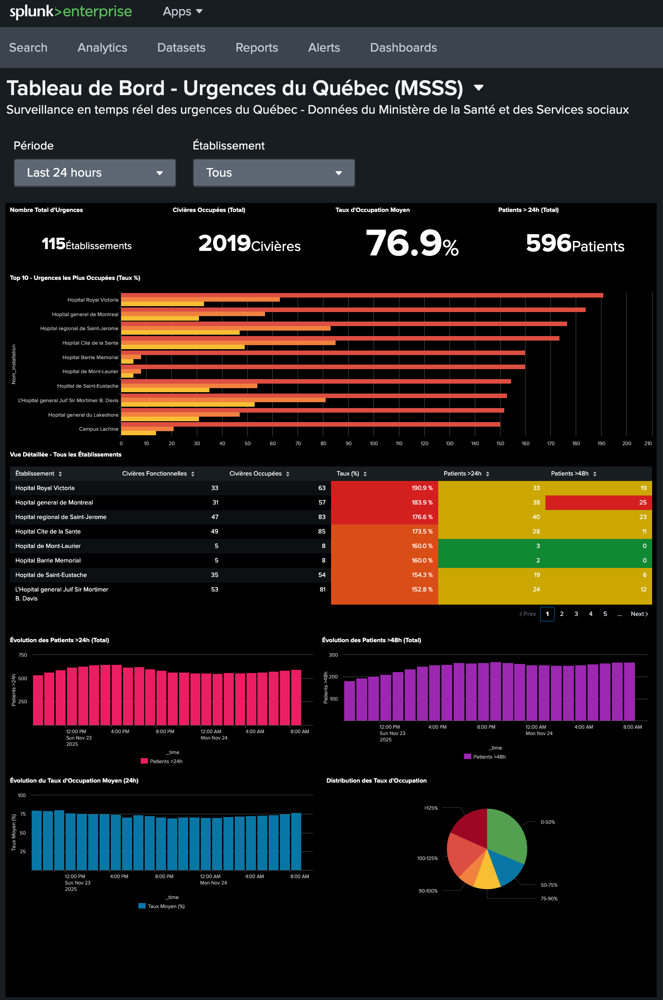

# Collecteur de données des urgences du Québec pour Splunk

Ce projet permet de collecter automatiquement les données horaires sur la situation dans les urgences du Québec et de les indexer dans Splunk pour analyse et visualisation.



## 📋 Table des matières

- [Description](#description)
- [Fonctionnalités](#fonctionnalités)
- [Prérequis](#prérequis)
- [Installation](#installation)
- [Configuration](#configuration)
- [Utilisation](#utilisation)
- [Dashboard Splunk](#dashboard-splunk)
- [Automatisation](#automatisation)
- [Dépannage](#dépannage)
- [Sources de données](#sources-de-données)
- [Licence](#licence)

## Description

Ce collecteur récupère les données horaires publiées par le Ministère de la Santé et des Services sociaux (MSSS) du Québec concernant la situation dans les urgences de la province. Les données incluent :

- Le taux d'occupation des civières
- Le nombre de patients sur civière
- Les temps d'attente
- La capacité des installations
- Et bien plus...

Les données sont ensuite envoyées à Splunk via HTTP Event Collector (HEC) pour permettre l'analyse, la surveillance et la création de tableaux de bord.

## Fonctionnalités

- ✅ Collecte automatique des données CSV depuis le portail Données Québec
- ✅ Nettoyage et normalisation des données (suppression des accents)
- ✅ Envoi par lots (batch) vers Splunk HEC
- ✅ Support des certificats SSL auto-signés
- ✅ Logging détaillé des opérations
- ✅ Mode debug pour visualiser les données envoyées
- ✅ Configuration flexible via fichier YAML
- ✅ Dashboard Splunk prêt à l'emploi

## Prérequis

### Système

- Linux (Ubuntu 20.04+ recommandé)
- Python 3.7 ou supérieur
- Accès réseau pour télécharger les données du MSSS

### Splunk

- Splunk Enterprise ou Splunk Cloud
- HTTP Event Collector (HEC) activé
- Token HEC configuré
- Index dédié (recommandé : `urgence_quebec`)

### Dépendances Python

```
requests
pyyaml
```

## Installation

### 1. Cloner le dépôt

```bash
git clone https://github.com/votre-compte/urgence-quebec-collector.git
cd urgence-quebec-collector
```
### 2. Installer les dépendances Python

```bash
pip3 install requests pyyaml
```

### 3. Configurer les permissions

```bash
chmod +x urgence_quebec_collector.py
```

## Configuration

### 1. Configuration Splunk HEC

Avant de configurer le collecteur, vous devez créer un token HEC dans Splunk :

1. Dans Splunk Web, allez à **Settings > Data Inputs > HTTP Event Collector**
2. Cliquez sur **New Token**
3. Configurez :
   - **Name** : `Urgences Quebec`
   - **Source type** : `msss:urgences:csv`
   - **Index** : `urgence_quebec` (créez l'index si nécessaire)
4. Notez le token généré

### 2. Configuration du collecteur

Éditez le fichier `config.yaml` :

```yaml
# Configuration pour le collecteur de données des urgences du Québec
# ====================================================================

# Source de données
data_source:
  url: "https://www.msss.gouv.qc.ca/professionnels/statistiques/documents/urgences/Releve_horaire_urgences_7jours.csv"

# Configuration Splunk HEC
splunk:
  # URL du HEC Splunk (remplacer par votre URL)
  hec_url: "https://votre-splunk.example.com:8088/services/collector/event"
  
  # Token HEC (remplacer par votre token)
  hec_token: "VOTRE-TOKEN-HEC-ICI"
  
  # Index Splunk cible
  index: "urgence_quebec"
  
  # Source du champ source
  source: "urgences_quebec"
  
  # Sourcetype pour les données
  sourcetype: "msss:urgences:csv"
  
  # Vérification SSL (mettre false si certificat auto-signé)
  verify_ssl: true
  
  # Taille des batchs pour l'envoi
  batch_size: 100

# Timeout pour les requêtes HTTP (en secondes)
timeout: 30

# Logging
logging:
  level: "INFO"
  file: "/var/log/urgences_quebec_collector.log"

# Options de debug
debug:
  # Afficher le JSON envoyé à Splunk dans la console
  print_json_output: false
  
  # Nombre maximum d'événements à afficher (pour éviter trop de sortie)
  max_events_to_print: 3
```

### 3. Paramètres importants

| Paramètre | Description | Valeur recommandée |
|-----------|-------------|-------------------|
| `hec_url` | URL complète de votre HEC Splunk | `https://votre-splunk:8088/services/collector/event` |
| `hec_token` | Token d'authentification HEC | Obtenez-le depuis Splunk |
| `index` | Index Splunk de destination | `urgence_quebec` |
| `verify_ssl` | Vérification du certificat SSL | `false` pour certificats auto-signés |
| `batch_size` | Nombre d'événements par batch | `100` (ajustez selon vos besoins) |
| `print_json_output` | Mode debug pour voir le JSON | `false` (mettez `true` pour déboguer) |

## Utilisation

### Exécution manuelle

Pour lancer une collecte unique :

```bash
python3 urgence_quebec_collector.py
```

Avec un fichier de configuration personnalisé :

```bash
python3 urgence_quebec_collector.py --config /chemin/vers/config.yaml
```

### Mode debug

Pour voir les données JSON envoyées à Splunk, activez le mode debug dans `config.yaml` :

```yaml
debug:
  print_json_output: true
  max_events_to_print: 3
```

Puis lancez le collecteur :

```bash
python3 urgence_quebec_collector.py
```

### Vérification dans Splunk

Après l'exécution, vérifiez que les données arrivent dans Splunk :

```spl
index=urgence_quebec sourcetype="msss:urgences:csv"
| head 10
```

## Dashboard Splunk

Un dashboard pré-configuré est inclus pour visualiser les données collectées.

### Installation du dashboard

#### Méthode 1 : Via l'interface Splunk Web (Recommandée)

1. Connectez-vous à Splunk Web
2. Allez à **Dashboards** dans le menu principal
3. Cliquez sur **Create New Dashboard**
4. Donnez un nom au dashboard : `Urgences Québec`
5. Choisissez **Dashboard Studio**
6. Une fois créé, cliquez sur **Source** (en haut à droite)
7. Supprimez tout le contenu JSON existant
8. Copiez-collez le contenu complet du fichier `urgence_quebec_dashboard.json`
9. Cliquez sur **Save**
10. Le dashboard sera accessible sous **Dashboards > Urgences Québec**

### Visualisations incluses

Le dashboard comprend :

- 📊 Taux d'occupation moyen par région
- 🏥 Top 10 des hôpitaux les plus occupés
- 📈 Évolution du taux d'occupation dans le temps
- 🚨 Alertes pour les hôpitaux dépassant 100% d'occupation
- 🗺️ Distribution géographique de l'occupation
- ⏱️ Temps d'attente moyen par installation

## Automatisation

### Avec cron

Pour exécuter le collecteur automatiquement toutes les heures :

1. Éditez la crontab :

```bash
crontab -e
```

2. Ajoutez la ligne suivante :

```cron
0 * * * * /usr/bin/python3 /chemin/vers/urgence_quebec_collector.py --config /chemin/vers/config.yaml >> /var/log/urgence_quebec_cron.log 2>&1
```

Cette configuration exécutera le collecteur à chaque heure pile (00:00, 01:00, 02:00, etc.).

## Dépannage

### Erreur de connexion à Splunk

```
Erreur lors de l'envoi à Splunk: [SSL: CERTIFICATE_VERIFY_FAILED]
```

**Solution** : Mettez `verify_ssl: false` dans le fichier `config.yaml` si vous utilisez un certificat auto-signé.

### Erreur d'encodage

```
UnicodeDecodeError: 'utf-8' codec can't decode byte...
```

**Solution** : Le collecteur gère automatiquement l'encodage `latin-1` et supprime les accents. Vérifiez que vous utilisez la dernière version du code.

### Aucune donnée dans Splunk

1. Vérifiez que le token HEC est correct
2. Vérifiez que l'index existe dans Splunk
3. Vérifiez que le HEC est activé dans Splunk
4. Lancez le collecteur en mode debug pour voir les données envoyées :

```yaml
debug:
  print_json_output: true
```

5. Vérifiez les logs Splunk :

```spl
index=_internal sourcetype=splunkd component=HttpEventCollector
```

### Problèmes de permissions

```bash
# Donner les permissions d'exécution
chmod +x urgence_quebec_collector.py

# Créer le répertoire de logs
sudo mkdir -p /var/log
sudo touch /var/log/urgences_quebec_collector.log
sudo chown $USER:$USER /var/log/urgences_quebec_collector.log
```

### Vérifier les logs

```bash
# Logs du collecteur
tail -f /var/log/urgences_quebec_collector.log

# Logs de cron (si applicable)
tail -f /var/log/urgence_quebec_cron.log

```

## Sources de données

### Données officielles

- **Source principale** : [Portail Données Québec](https://www.donneesquebec.ca/recherche/dataset/fichier-horaire-des-donnees-de-la-situation-a-l-urgence)
- **URL du fichier CSV** : https://www.msss.gouv.qc.ca/professionnels/statistiques/documents/urgences/Releve_horaire_urgences_7jours.csv
- **Fréquence de mise à jour** : Toutes les heures
- **Période couverte** : 7 derniers jours

### Structure des données

Les données incluent pour chaque installation :

- Nom de l'établissement et de l'installation
- Région sociosanitaire (RSS)
- Nombre de civières fonctionnelles et occupées
- Nombre de patients sur civière
- Taux d'occupation (%)
- Nombre de patients en attente
- Durée moyenne et médiane de l'attente
- Horodatage de la mise à jour

## Licence

Ce projet est sous licence MIT. Voir le fichier `LICENSE` pour plus de détails.

## Contribution

Les contributions sont les bienvenues ! N'hésitez pas à :

- Signaler des bugs
- Proposer de nouvelles fonctionnalités
- Soumettre des pull requests

L'ensemble de ce projet a été créé avec l'aide de Claude.ai.

## Support

Ce code est fourni à titre d'exemple et devrait être validé et testé avant toute utilisation en production.
Pour toute question ou problème :

- Ouvrez une issue sur GitHub
- Consultez la documentation de Splunk HEC : https://docs.splunk.com/Documentation/Splunk/latest/Data/UsetheHTTPEventCollector

---

**Note** : Ce projet n'est pas affilié au Ministère de la Santé et des Services sociaux du Québec. Les données sont publiques et utilisées conformément aux conditions d'utilisation du portail Données Québec.
